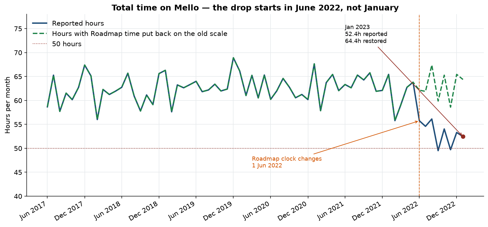
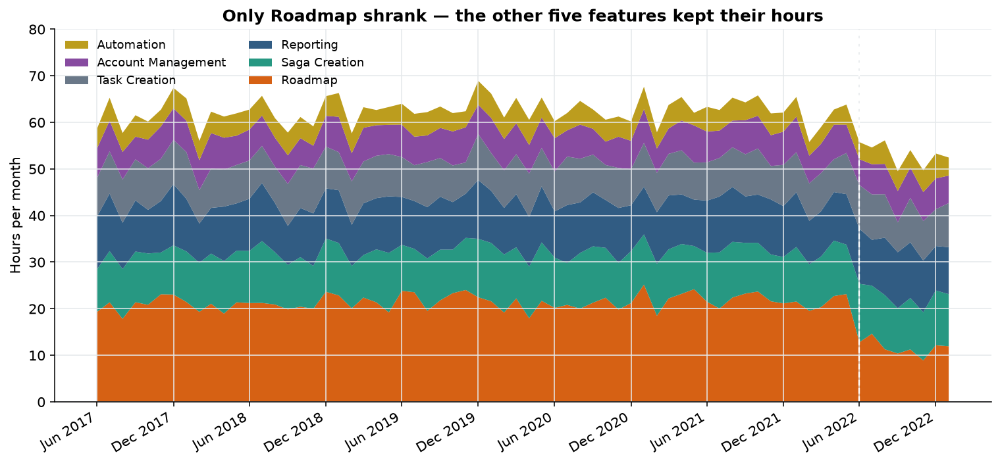
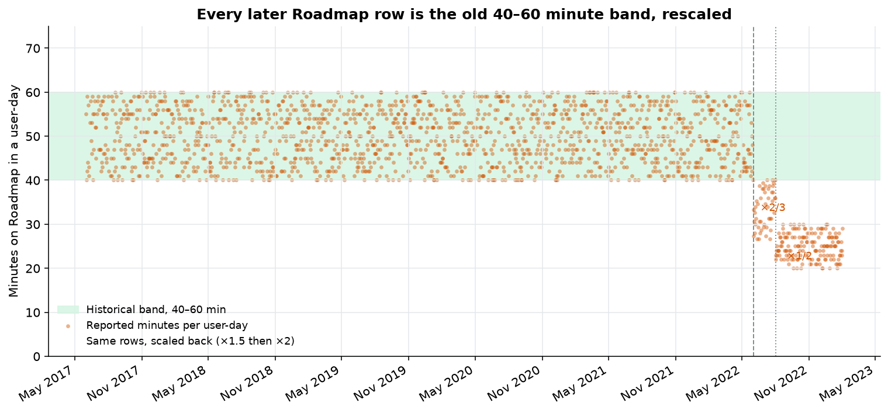
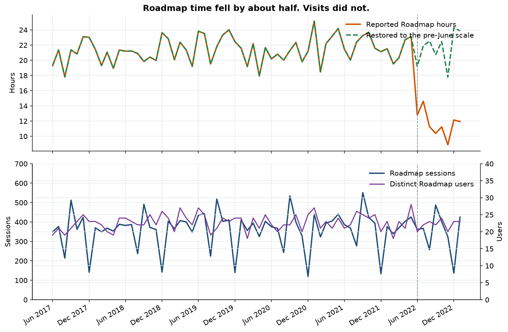

**To:** Casey (casey@mello.com)
**From:** you (your_name@mello.com)
**Subject:** Re: Something happened in January?
**Attachment:** four charts from the 2017–2023 usage export

Casey,

January looks soft in the export, and the customer is still using Mello at a normal rate. The missing hours are a change in how Roadmap time is recorded, starting 1 June 2022. Sessions, people, and the other five feature areas did not drop with it.

## The short version

The customer’s January 2023 total is **52.4 hours (3,146 minutes)**. That is the lowest January in the file, **20.7% below** the previous five Januaries, which averaged **66.1 hours**. It is just above the 50-hour line you remembered. The two months that did print under 50 hours are September 2022 (49.5) and November 2022 (49.7). All three sit in the same stretch, which begins in June 2022.

From June 2017 through May 2022, this customer averaged **62.5 hours a month**. From June 2022 through January 2023 the reported average is **53.2 hours**. That is about **9.3 hours a month** gone. **Roadmap accounts for the entire decline** (about 9.7 hours a month). The other five features together are flat to slightly higher.

Put Roadmap back on its old minute scale and the “missing” hours come back. June 2022 onward then averages **63.1 hours**, in line with the prior five years. January 2023 comes back to **64.4 hours**, next to the old January average of 66.1.

I would not take this to the account team as a usage collapse. I would take it to engineering as a Roadmap timer question, with the dates below.

## What I looked at

The export is `data/usage_data.csv`: **10,575 rows**, **100 users**, **1 June 2017 through 31 January 2023**. Each row is one person, one feature, one day. Time is in minutes. The six feature areas are Roadmap, Reporting, Saga Creation, Task Creation, Account Management (spelled “Account Managment” in the file), and Automation.

“Average time spent” is just minutes divided by sessions. It does not add a second measurement. There are no empty days, no duplicate user-feature-days, and no blank fields.

Dates in the file are day/month/year. I read them that way (1 June 2017 is the first row, and the days count upward inside each month).

## January is a low reading of a change that is already eight months old

Prior Januaries, hours:

| Month | Total | Roadmap | Everything else |
| --- | ---: | ---: | ---: |
| Jan 2018 | 65.1 | 21.4 | 43.7 |
| Jan 2019 | 66.3 | 22.8 | 43.5 |
| Jan 2020 | 66.2 | 21.6 | 44.6 |
| Jan 2021 | 67.6 | 25.2 | 42.5 |
| Jan 2022 | 65.4 | 21.5 | 43.9 |
| **Jan 2023** | **52.4** | **11.9** | **40.5** |

Roadmap is **10.6 of the 13.7 hour** gap versus a typical January (about three quarters of it). The other features together are **3.1 hours** under their usual January, which is a soft month for them and still inside the range they have always moved in. Their long-run average is about 41 hours, with a typical month-to-month swing of about 2 hours. January 2023’s 40.5 hours on those five features is an ordinary month.

January has historically been a *high* month for this customer (about 66 hours, versus about 62 in a typical month), including through January 2022. There is no repeating January slump to explain 2023. February is the month that usually dips, into the mid-50s, and it has done that every year.

## The hours left Roadmap, and they left on two exact scales

Average hours per month:

| Feature | Jun 2017–May 2022 | Jun 2022–Jan 2023 | Change |
| --- | ---: | ---: | ---: |
| Roadmap | 21.4 | 11.7 | −9.7 |
| Reporting | 10.8 | 11.1 | +0.2 |
| Saga Creation | 10.8 | 11.1 | +0.2 |
| Task Creation | 8.6 | 8.8 | +0.2 |
| Account Management | 6.5 | 6.3 | −0.2 |
| Automation | 4.4 | 4.3 | −0.1 |

For five years, a Roadmap user-day in this file was always between **40 and 60 minutes**, averaging **50.1**. No other feature shares that band. Reporting and Saga Creation sit around 15–35, Task Creation around 10–30, Account Management around 5–25, Automation around 0–20. Those bands never moved.

Roadmap’s band breaks on **1 June 2022**, and it breaks arithmetically:

- **1 June through 31 July 2022 (49 user-days).** Every Roadmap minute value is exactly two-thirds of a whole number between 40 and 60. Multiply by 1.5 and all 49 rows land back in 40–60, average **50.3**. Several of those raw values are repeating thirds (27.333…, 30.666…, 38.666…). Roadmap is the only feature with a fractional minute anywhere in five years, and every fractional minute falls in this window.
- **1 August 2022 through 31 January 2023 (158 user-days).** Every Roadmap minute value is exactly half of a whole number between 40 and 60. Multiply by 2 and all 158 rows land back in 40–60, average **50.0**. The reported values sit in a tight 20–30 minute band.

Zero exceptions in either window. The chart below is each Roadmap user-day. The green marks are those same rows multiplied back up. They sit in the old band.

That is what a clock change looks like. A real slowdown in the feature would not hit every person, on every day, at exactly 2/3 and then exactly 1/2, while reproducing the old 40–60 shape down to the average.

## People kept showing up

| | Jan 2022 | Jan 2023 |
| --- | ---: | ---: |
| Roadmap hours, as reported | 21.5 | 11.9 |
| Distinct people on Roadmap | 23 | 23 |
| Roadmap sessions | 376 | 425 |
| Roadmap user-days | 25 | 29 |
| People active on any feature | 80 | 78 |

The long-run average is **79 active users a month**, out of 100 usernames that appear across the file. January 2023 has 78. Nobody dropped off the customer’s roster in a way that shows up here. The 13 people who have no Roadmap rows after June 2022 are still in the other features.

Session counts bounce around for a reason that predates this. Every August and every December, sessions fall hard (December is often around half of a normal month) while **minutes stay up**, because the recorded sessions run longer. January sessions have always been among the highest of the year. January 2023 follows that pattern. A session chart on its own will look alarming in December of every year; the minutes do not agree, and they have never agreed.

## What I would do with this

1. **Ask engineering what changed in Roadmap duration tracking on 1 June 2022 and again on 1 August 2022.** Useful specifics: whether the event definition changed, whether idle time was excluded, whether a timer was divided by a constant, or whether a release those weeks touched the Roadmap page. The 2/3 scale lasts exactly two months and the 1/2 scale starts cleanly on 1 August.
2. **Hold the churn conversation until that answer is back.** On the old scale, this customer’s recent months, including January, sit in the historical range. September and November only fall under 50 hours on the new scale; restored, they are about 60 and 59 hours.
3. **Stop mixing pre-June and post-June Roadmap hours** in health scores, QBRs, or renewal decks until the definition is confirmed. A 45% Roadmap drop will keep getting flagged, and it will keep being this same break.
4. **If someone still wants a customer touch, ask a different question.** “Did Roadmap get faster for you around June, or are you spending less time planning?” The export says they opened Roadmap as often as before. Faster completion and a broken timer produce the same minute total; only the timer produces exact thirds and halves.

Happy to walk through the charts live, or to rerun this on the next month once it lands.

Thanks
